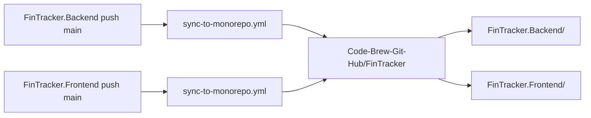

# Синхронизация Backend / Frontend → монорепозиторий

При **push в `main`** репозиториев [FinTracker.Backend](https://github.com/Code-Brew-Git-Hub/FinTracker.Backend) и [FinTracker.Frontend](https://github.com/Code-Brew-Git-Hub/FinTracker.Frontend) GitHub Actions копирует код в папки `FinTracker.Backend/` и `FinTracker.Frontend/` ветки **`Lenyas's-final-version`** репозитория [FinTracker](https://github.com/Code-Brew-Git-Hub/FinTracker).

## Схема

## Однократная настройка

### 1. Personal Access Token

Создайте [classic PAT](https://github.com/settings/tokens) с правом **repo** (доступ к организации Code-Brew-Git-Hub).

Рекомендуется отдельный machine-user или бот-аккаунт; токен храните только в Secrets.

### 2. Секрет в монорепозитории

`Code-Brew-Git-Hub/FinTracker` → **Settings → Secrets and variables → Actions** → **New repository secret**

| Имя | Значение |
|-----|----------|
| `MONOREPO_SYNC_TOKEN` | ваш PAT |

Нужен для ручного workflow [sync-from-subrepos.yml](../.github/workflows/sync-from-subrepos.yml) (Actions → Run workflow).

### 3. Секрет в каждом субрепозитории

Тот же секрет `MONOREPO_SYNC_TOKEN` добавьте в:

- [FinTracker.Backend](https://github.com/Code-Brew-Git-Hub/FinTracker.Backend/settings/secrets/actions)
- [FinTracker.Frontend](https://github.com/Code-Brew-Git-Hub/FinTracker.Frontend/settings/secrets/actions)

### 4. Workflow в субрепозиториях

Скопируйте шаблоны в **корень** соответствующего репозитория как `.github/workflows/sync-to-monorepo.yml`:

| Шаблон в монорепо | Куда положить |
|-------------------|---------------|
| [.github/templates/sync-to-monorepo.backend.yml](../.github/templates/sync-to-monorepo.backend.yml) | `FinTracker.Backend/.github/workflows/sync-to-monorepo.yml` |
| [.github/templates/sync-to-monorepo.frontend.yml](../.github/templates/sync-to-monorepo.frontend.yml) | `FinTracker.Frontend/.github/workflows/sync-to-monorepo.yml` |

Закоммитьте и запушьте в `main` каждого субрепозитория.

### 5. Секрет и workflow в монорепозитории

Запушьте ветку `Lenyas's-final-version` с `.github/workflows/sync-from-subrepos.yml` и добавьте `MONOREPO_SYNC_TOKEN` (шаг 2).

## Смена целевой ветки

В трёх файлах измените `MONOREPO_BRANCH` / `MONOREPO_BRANCH`:

- `.github/templates/sync-to-monorepo.backend.yml`
- `.github/templates/sync-to-monorepo.frontend.yml`
- `.github/workflows/sync-from-subrepos.yml`

и обновите workflow в субрепозиториях.

## Синхронизация других веток

По умолчанию триггер только **`main`** в субрепозиториях. Чтобы синхронизировать другие ветки, добавьте их в `on.push.branches` в `sync-to-monorepo.yml`.

## Проверка

1. Сделайте тестовый commit в `main` Backend или Frontend.
2. **Actions** в субрепозитории → workflow **Sync to monorepo** должен завершиться успешно.
3. В [FinTracker](https://github.com/Code-Brew-Git-Hub/FinTracker/tree/Lenyas's-final-version) появится commit `chore: sync FinTracker.*`.
